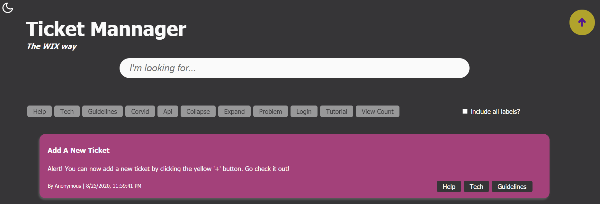
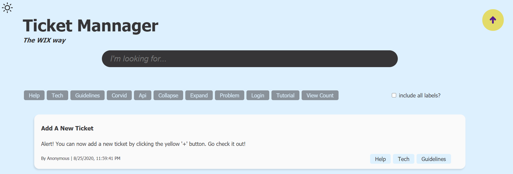
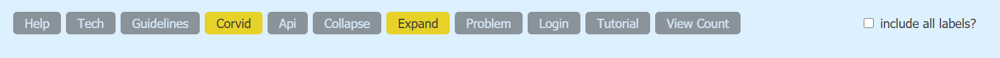
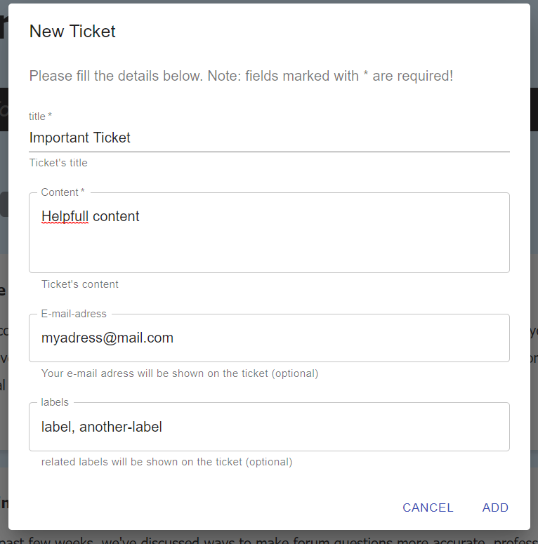
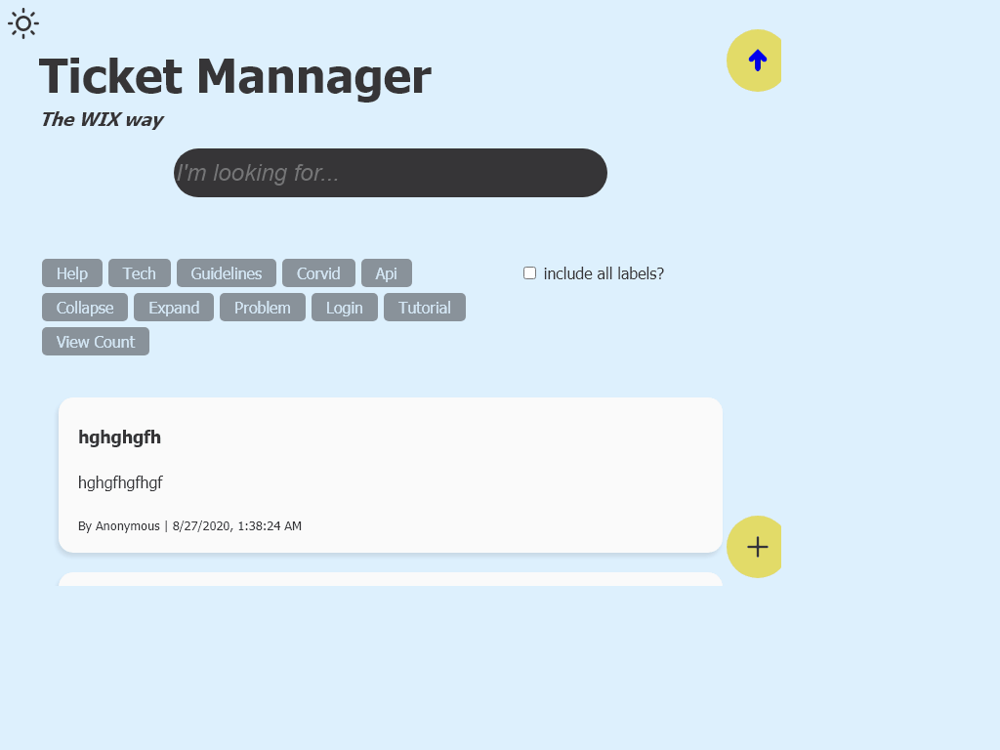

# Final 2 - Cyber4s. Nitzan Listman

## Introducing: Dark mode 

For those who are binded by light colors, worry no more! 
Click the sun logo in the top left corner of the site and welcome yourself to the dark side.  
  
Wanna go back? Click the moon  

   

## Filter by label 

To filter by label click the labels you'd like to see. Either in the search bar or a ticket. 
If you want to filter only the tickets that include all active labels, check the box to the right of the labels bar  

 
Active labels appear yellow, inactive faded grey.

   

## Add new ticket  

Click the yellow plus button, and a form will pop up. 
Fill the form and click add to add your ticket. 
You can add labels to your ticket (optional), but pay attention! 
To seperate two labels use a comma - ','. A space bar will just count as multi word label. 
Email adress is also optional.  

 

   

## More features  

Back to top button: 
 

   

[Link to glitch](https://listguy-ticket-mannager-glitch2-2.glitch.me)

   

## gif  

